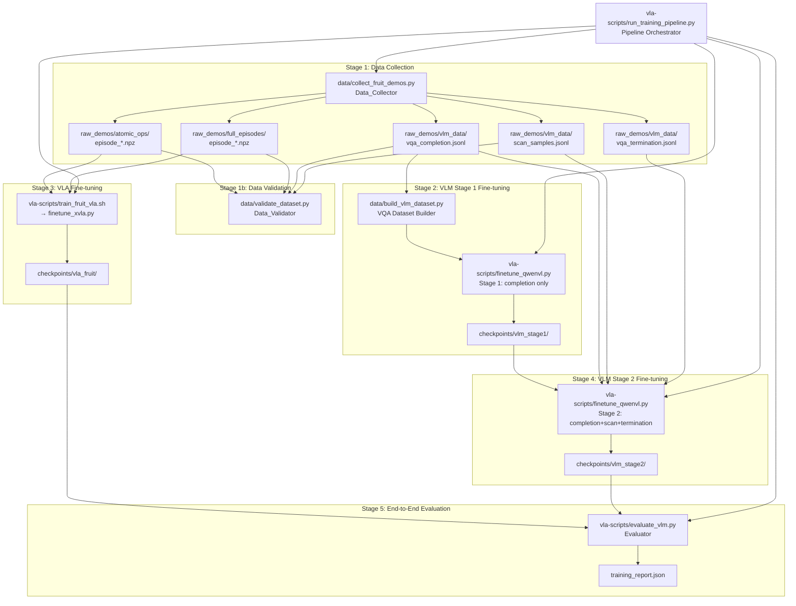
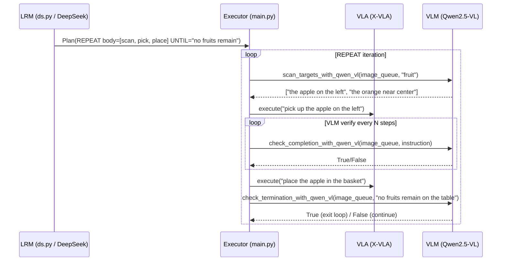
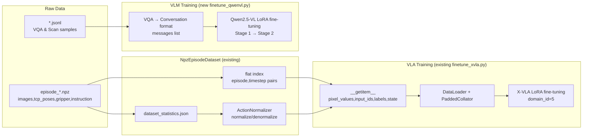

# Design Document: Blueberry Harvest Training (Multi-Fruit Table Clearing)

## Overview

本设计文档描述**桌面水果收纳长时序任务**（Multi-Fruit Table Clearing Task）的完整数据采集与模型训练方案。系统基于已有的 PEV（Plan → Execute → Verify）三层架构，目标是让机器人将桌上所有水果（种类不同、数量未知）逐一放入指定篮子，直到桌面清空。

### 核心设计原则

1. **最大化复用**：直接复用 `NpzEpisodeDataset`、`ActionNormalizer`、`finetune_xvla.py`、`qwenvl.py`、`ds.py` 等已有组件，不重复造轮子。
2. **关注点分离**：数据采集、数据验证、VLA 训练、VLM 训练、评估各自独立，通过 `run_training_pipeline.py` 编排。
3. **可验证性**：每个阶段输出均有量化指标，通过 `Data_Validator` 和 `Evaluator` 自动检查。
4. **属性驱动测试**：使用 Hypothesis 对核心数据变换（归一化、解析、索引）进行属性测试。

### 与已有系统的关系

```
已有组件（不修改）                新增组件
─────────────────────────────────────────────────────────────────
experiments/robot/libero/ds.py    experiments/robot/libero/test_lrm.py
experiments/robot/libero/qwenvl.py
experiments/robot/libero/main.py  data/collect_fruit_demos.py
vla-scripts/finetune_xvla.py      data/build_vlm_dataset.py
vla-scripts/npz_dataset.py        data/validate_dataset.py
                                  vla-scripts/train_fruit_vla.sh
                                  vla-scripts/finetune_qwenvl.py
                                  vla-scripts/evaluate_vlm.py
                                  vla-scripts/run_training_pipeline.py
                                  tests/test_properties.py
```

## Architecture

### 系统整体架构



### PEV 运行时架构（已有，不修改）



### 数据流图



## Components and Interfaces

### 1. `data/collect_fruit_demos.py` — Data_Collector

数据采集脚本，扩展自 `data/dataset.py`（已有的 UR7e 采集脚本）。

```python
# 主要类和函数

class FruitDemoCollector:
    """
    遥操作演示数据采集器。
    复用 data/dataset.py 的 RealSense + RTDE 采集逻辑，
    增加水果任务专用的元数据记录和验证。
    """
    def __init__(self, save_dir: str, task_type: str, fruit_type: str):
        # task_type: "atomic_ops" | "full_episodes"
        # fruit_type: "apple" | "orange" | "banana" | "pear" | "tomato"
        ...

    def collect_episode(self) -> Optional[EpisodeMetadata]:
        """
        录制一条 Episode，验证时序一致性，保存 npz。
        Returns None if validation fails (discards episode).
        """
        ...

    def verify_temporal_consistency(self, episode_data: dict) -> bool:
        """
        验证 images.shape[0] == tcp_poses.shape[0] == gripper.shape[0]。
        Requirement 1.5
        """
        T = episode_data["images"].shape[0]
        return all(
            episode_data[k].shape[0] == T
            for k in ["images_wrist", "tcp_poses", "joint_positions", "gripper"]
        )

    def save_episode(self, episode_data: dict, metadata: EpisodeMetadata) -> Path:
        """保存 npz 文件，写入元数据 JSON sidecar。"""
        ...

    def compute_and_save_statistics(self) -> dict:
        """
        调用 compute_dataset_statistics()，保存 dataset_statistics.json。
        Requirement 1.7
        """
        from vla_scripts.npz_dataset import compute_dataset_statistics
        ...


@dataclass
class EpisodeMetadata:
    """完整 Episode 的元数据（Requirement 2.4）"""
    episode_id: int
    task_type: str          # "atomic_ops" | "full_episodes"
    fruit_type: str
    total_fruit_count: int
    fruit_types_present: List[str]
    successfully_placed_count: int
    loop_iterations: int
    total_timestep_count: int
    spatial_position: str   # "left" | "center" | "right"
    scene_config: str       # "max_variety" | "same_type" | "spatial_layout"


def build_instruction(task_type: str, fruit_type: str) -> str:
    """
    生成标准化指令字符串（Requirement 1.6）。
    task_type="pick_up" → "pick up the apple"
    task_type="place"   → "place the apple in the basket"
    """
    ...


def collect_vqa_sample(
    images: List[np.ndarray],
    instruction: str,
    answer: str,
    operation_type: str,
    fruit_type: str,
    failure_mode: Optional[str] = None,
) -> VQASample:
    """构造 VQA 样本（Requirement 3.2, 3.3, 3.6）"""
    ...


@dataclass
class VQASample:
    """VQA 样本（Requirement 3.6）"""
    image_paths: List[str]      # 必须恰好 2 个（main + wrist）
    question: str               # 标准化模板
    answer: str                 # "Yes" | "No"
    operation_type: str
    fruit_type: str
    failure_mode: Optional[str]


@dataclass
class ScanSample:
    """目标扫描样本（Requirement 4.6）"""
    image_path: str
    visible_targets: List[str]  # 有序列表，空列表表示桌面已清空
    target_count: int
    fruit_types_present: List[str]
```

### 2. `data/build_vlm_dataset.py` — VQA Dataset Builder

将 JSONL 格式的 VQA 样本转换为 Qwen2.5-VL 对话格式。

```python
def load_vqa_samples(jsonl_path: str) -> List[VQASample]:
    """从 JSONL 文件加载 VQA 样本。"""
    ...


def vqa_sample_to_conversation(sample: VQASample) -> dict:
    """
    将 VQASample 转换为 Qwen2.5-VL 对话格式（Requirement 6.2）。

    Returns:
        {
            "messages": [
                {
                    "role": "user",
                    "content": [
                        {"type": "image", "image": "<path_or_base64>"},
                        {"type": "image", "image": "<path_or_base64>"},
                        {"type": "text",  "text": "<question>"}
                    ]
                },
                {
                    "role": "assistant",
                    "content": [{"type": "text", "text": "<answer>"}]
                }
            ]
        }
    """
    ...


def scan_sample_to_conversation(sample: ScanSample) -> dict:
    """将 ScanSample 转换为 Qwen2.5-VL 对话格式（扫描任务）。"""
    ...


def build_stage1_dataset(
    vqa_completion_path: str,
    output_path: str,
    val_split: float = 0.1,
) -> Tuple[List[dict], List[dict]]:
    """
    构建 Stage 1 训练集（仅子任务完成验证数据）。
    Returns (train_conversations, val_conversations).
    """
    ...


def build_stage2_dataset(
    vqa_completion_path: str,
    scan_samples_path: str,
    vqa_termination_path: str,
    output_path: str,
    val_split: float = 0.1,
) -> Tuple[List[dict], List[dict]]:
    """
    构建 Stage 2 训练集（验证 + 扫描 + 终止判断数据）。
    Returns (train_conversations, val_conversations).
    """
    ...


def compute_label_balance(conversations: List[dict]) -> float:
    """
    计算正负样本比例（Requirement 3.7, 9.7）。
    Returns positive_ratio = positive_count / total_count.
    """
    ...
```

### 3. `data/validate_dataset.py` — Data_Validator

数据质量验证模块，运行所有正确性属性检查。

```python
class DataValidator:
    """
    数据质量验证器。
    每个 validate_* 方法对应一个需求中的正确性属性。
    """

    def __init__(self, data_root: str):
        self.atomic_ops_dir = os.path.join(data_root, "atomic_ops")
        self.full_episodes_dir = os.path.join(data_root, "full_episodes")
        self.vlm_data_dir = os.path.join(data_root, "vlm_data")

    def validate_temporal_consistency(self, npz_path: str) -> ValidationResult:
        """
        验证时序维度一致性（Requirement 9.1）。
        images.shape[0] == images_wrist.shape[0] == tcp_poses.shape[0]
                        == joint_positions.shape[0] == gripper.shape[0]
        """
        ...

    def validate_action_normalizer_roundtrip(
        self,
        stats: dict,
        threshold: float = 1e-5,
    ) -> ValidationResult:
        """
        验证 ActionNormalizer 的 round-trip 属性（Requirement 9.2）。
        For all valid action vectors a: ||denormalize(normalize(a)) - a||_∞ < threshold
        """
        ...

    def validate_dataset_index_invariance(
        self,
        dataset: NpzEpisodeDataset,
        num_samples: int = 100,
    ) -> ValidationResult:
        """
        验证 NpzEpisodeDataset 索引不变性（Requirement 9.3）。
        For all valid indices i: dataset[i] called twice returns identical tensors.
        """
        ...

    def validate_normalized_action_range(
        self,
        stats: dict,
        num_samples: int = 1000,
    ) -> ValidationResult:
        """
        验证归一化动作值域约束（Requirement 9.4）。
        For all normalized actions a_norm: each dimension in [-1.0, 1.0].
        """
        ...

    def validate_statistics_completeness(self, stats_path: str) -> ValidationResult:
        """
        验证 dataset_statistics.json 完整性（Requirement 9.5）。
        Must contain: action.mean, action.std, action.q01, action.q99,
                      state.mean, state.std, num_transitions, num_episodes.
        """
        REQUIRED_FIELDS = [
            ("action", "mean"), ("action", "std"),
            ("action", "q01"), ("action", "q99"),
            ("state", "mean"), ("state", "std"),
            ("num_transitions",), ("num_episodes",),
        ]
        ...

    def validate_vqa_label_balance(
        self,
        jsonl_path: str,
        low: float = 0.45,
        high: float = 0.55,
    ) -> ValidationResult:
        """
        验证 VQA 数据集标签分布（Requirement 9.7）。
        Computes positive_ratio; emits warning if outside [low, high].
        The check itself always passes (warning is informational only).
        """
        ...

    def validate_parse_llm_plan_idempotence(
        self,
        plan_strings: List[str],
    ) -> ValidationResult:
        """
        验证 parse_llm_plan 的幂等性（Requirement 9.8）。
        For all valid plan strings s:
            parse_llm_plan(format_plan(parse_llm_plan(s))) == parse_llm_plan(s)
        """
        ...

    def run_all(self) -> ValidationReport:
        """运行所有验证检查，返回汇总报告。"""
        ...


@dataclass
class ValidationResult:
    passed: bool
    message: str
    details: Optional[dict] = None


@dataclass
class ValidationReport:
    results: List[ValidationResult]
    all_passed: bool
    summary: str


def format_plan(plan: Plan) -> str:
    """
    将 Plan 对象序列化为字符串（用于 round-trip 测试）。
    Linear steps → numbered list.
    RepeatBlock → REPEAT: ... UNTIL: ... format.
    """
    lines = []
    step_num = 1
    for step in plan.steps:
        if isinstance(step, str):
            lines.append(f"{step_num}. {step}")
            step_num += 1
        elif isinstance(step, RepeatBlock):
            lines.append("REPEAT:")
            for i, body_step in enumerate(step.body, 1):
                lines.append(f"  {i}. {body_step}")
            lines.append(f"UNTIL: {step.until_condition}")
    return "\n".join(lines)
```

### 4. `vla-scripts/train_fruit_vla.sh` — VLA Training Shell Script

封装 `finetune_xvla.py` 的 Shell 脚本，设置水果清理任务专用参数。

```bash
#!/bin/bash
# train_fruit_vla.sh — X-VLA LoRA fine-tuning for fruit-clearing task
# Usage: bash vla-scripts/train_fruit_vla.sh [NPZ_DATA_DIR] [NUM_GPUS]

NPZ_DATA_DIR=${1:-"raw_demos/mixed"}   # mixed atomic_ops + full_episodes (3:1)
NUM_GPUS=${2:-4}

torchrun \
    --standalone \
    --nnodes 1 \
    --nproc-per-node $NUM_GPUS \
    vla-scripts/finetune_xvla.py \
    --pretrained_checkpoint "HuggingFaceM4/xvla-7b" \
    --npz_data_dir "$NPZ_DATA_DIR" \
    --domain_id 5 \
    --lora_rank 32 \
    --learning_rate 2e-4 \
    --batch_size 8 \
    --grad_accumulation_steps 4 \
    --max_steps 20000 \
    --save_steps 500 \
    --image_aug True \
    --run_root_dir "runs/fruit_vla" \
    --wandb_project "fruit-clearing-vla" \
    --run_id_note "fruit_clearing_domain5"
```

数据混合策略（3:1 atomic_ops : full_episodes）通过 `run_training_pipeline.py` 在调用脚本前预先构建混合数据目录实现：将 atomic_ops 中的 episode 文件和 full_episodes 中的 episode 文件按 3:1 比例符号链接到 `raw_demos/mixed/`，然后重新计算 `dataset_statistics.json`。

### 5. `vla-scripts/finetune_qwenvl.py` — Qwen2.5-VL LoRA Fine-tuning

```python
@dataclass
class QwenVLFinetuneConfig:
    # Model
    pretrained_checkpoint: str = "Qwen/Qwen2.5-VL-7B-Instruct"

    # Data
    stage: int = 1                      # 1 = completion only; 2 = all tasks
    train_data_path: str = ""           # Path to train conversations JSONL
    val_data_path: str = ""             # Path to val conversations JSONL

    # LoRA hyperparameters (Requirement 6.1)
    lora_rank: int = 16
    learning_rate: float = 1e-4
    batch_size: int = 4
    max_steps: int = 5000
    save_steps: int = 500
    lora_dropout: float = 0.05
    lora_target_modules: str = "all-linear"

    # Output
    run_root_dir: str = "runs/qwen_vl"
    wandb_project: str = "fruit-clearing-vlm"


class QwenVLConversationDataset(Dataset):
    """
    Dataset for Qwen2.5-VL fine-tuning.
    Loads conversations from JSONL, applies chat template,
    processes images via qwen_vl_utils.process_vision_info.
    """
    def __init__(self, conversations: List[dict], processor: AutoProcessor):
        ...

    def __len__(self) -> int: ...

    def __getitem__(self, idx: int) -> dict:
        """
        Returns dict with:
            input_ids: torch.Tensor
            attention_mask: torch.Tensor
            pixel_values: torch.Tensor (or list for multi-image)
            labels: torch.Tensor (prompt positions masked to -100)
        """
        ...


def finetune_qwenvl(cfg: QwenVLFinetuneConfig) -> None:
    """
    Main fine-tuning loop for Qwen2.5-VL.
    Uses transformers + peft (LoRA).
    Supports two-stage training (Requirement 6.3).
    """
    ...
```

### 6. `vla-scripts/evaluate_vlm.py` — VLM Evaluator

```python
class VLMEvaluator:
    """
    在验证集上评估 VLM 的各项指标（Requirement 9.6）。
    """

    def __init__(self, model_id: str, device: str = "auto"):
        self.vlm_model, self.vlm_processor = load_qwen_vl_model(model_id, device)

    def evaluate_completion(
        self,
        val_samples: List[VQASample],
    ) -> CompletionMetrics:
        """
        计算 check_completion_with_qwen_vl 的 Precision 和 Recall（Requirement 9.6）。
        Uses confusion matrix: TP, FP, TN, FN.
        Both Precision and Recall must be >= 0.80.
        """
        ...

    def evaluate_termination(
        self,
        val_samples: List[VQASample],
    ) -> TerminationMetrics:
        """
        计算 check_termination_with_qwen_vl 的准确率（Requirement 6.5）。
        Accuracy must be >= 0.90.
        """
        ...

    def evaluate_scanning(
        self,
        val_samples: List[ScanSample],
    ) -> ScanMetrics:
        """
        计算 scan_targets_with_qwen_vl 的水果数量准确率（Requirement 6.6）。
        Accuracy = fraction of samples where |predicted_count - annotated_count| <= 1.
        Must be >= 0.80.
        """
        ...


@dataclass
class CompletionMetrics:
    precision: float
    recall: float
    f1: float
    accuracy: float
    confusion_matrix: dict  # {"TP": int, "FP": int, "TN": int, "FN": int}


@dataclass
class TerminationMetrics:
    accuracy: float
    confusion_matrix: dict


@dataclass
class ScanMetrics:
    count_accuracy: float   # fraction with |pred - gt| <= 1
    mean_abs_error: float
```

### 7. `vla-scripts/run_training_pipeline.py` — Pipeline Orchestrator

```python
class TrainingPipeline:
    """
    训练流水线编排器（Requirement 8）。
    按顺序执行 5 个阶段，每个阶段前检查前置条件。
    """

    def __init__(self, config: PipelineConfig):
        self.config = config
        self.validator = DataValidator(config.data_root)

    def check_stage2_prerequisites(self) -> None:
        """
        验证 Stage 2 前置条件（Requirement 8.2）：
        VQA 数据集存在且样本数 >= 400。
        Raises PipelineError if not met.
        """
        ...

    def check_stage3_prerequisites(self) -> None:
        """
        验证 Stage 3 前置条件（Requirement 8.3）：
        npz 数据集存在且 Episode 数 >= 300。
        Raises PipelineError if not met.
        """
        ...

    def check_stage5_prerequisites(self) -> None:
        """
        验证 Stage 5 前置条件（Requirement 8.4）：
        VLA checkpoint 和 VLM checkpoint 均存在。
        Raises PipelineError if not met.
        """
        ...

    def run_stage(self, stage_id: int) -> StageReport:
        """
        运行单个阶段，生成训练报告（Requirement 8.5）。
        Report contains: training_duration, final_loss,
                         validation_metrics, checkpoint_path.
        """
        ...

    def run_all(self) -> List[StageReport]:
        """按顺序运行所有 5 个阶段（Requirement 8.1）。"""
        ...


@dataclass
class StageReport:
    stage_id: int
    training_duration_seconds: float
    final_loss: float
    validation_metrics: dict
    checkpoint_path: str
    success: bool
    error_message: Optional[str] = None


class PipelineError(Exception):
    """前置条件检查失败时抛出。"""
    pass
```

### 8. `experiments/robot/libero/test_lrm.py` — LRM Tests

```python
"""
test_lrm.py — LRM 提示工程验证测试（Requirement 7）

Tests:
  - _is_harvest_task keyword routing
  - parse_llm_plan REPEAT...UNTIL parsing
  - parse_llm_plan round-trip (serialize → parse → compare)
  - parse_llm_plan idempotence
"""

HARVEST_KEYWORDS = [
    "all", "every", "each", "all fruits", "all objects", "all items",
    "clear the table", "clear all", "collect all", "gather all",
    "harvest", "gather", "collect",
    "所有", "全部", "所有水果", "清空", "收集所有", "摘", "采",
]

SAMPLE_HARVEST_PLAN = """
REPEAT:
  1. scan the table
  2. pick up the nearest visible fruit on the table
  3. place the fruit in the basket
UNTIL: no fruits remain on the table
"""

SAMPLE_LINEAR_PLAN = """
1. pick up the apple
2. place the apple in the basket
"""
```

### 9. `tests/test_properties.py` — Property-Based Tests

```python
"""
test_properties.py — 使用 Hypothesis 的属性测试（Requirement 9）

Property tests for:
  - ActionNormalizer round-trip (9.2)
  - NpzEpisodeDataset index invariance (9.3)
  - Normalized action value range (9.4)
  - dataset_statistics.json completeness (9.5)
  - VQA label balance check (9.7)
  - parse_llm_plan idempotence (9.8)
  - _is_harvest_task keyword routing (7.1)
  - parse_llm_plan REPEAT block parsing (7.2, 7.4)
  - Plan round-trip (7.5)
  - Temporal consistency (9.1)
  - VQA sample structure (3.2, 3.3, 3.6)
  - Scan sample structure (4.3, 4.6)
  - Pipeline prerequisite checks (8.2, 8.3, 8.4)
  - Data mixing ratio (5.6)
  - VQA to conversation format (6.2)
"""
```

## Data Models

### npz Episode 格式（已有，不修改）

```
episode_NNNN.npz
├── images          uint8   (T, 256, 256, 3)   主视角 RGB
├── images_wrist    uint8   (T, 256, 256, 3)   腕部视角 RGB
├── tcp_poses       float64 (T, 6)             [x, y, z, roll, pitch, yaw]
├── joint_positions float64 (T, 6)             关节角
├── gripper         float64 (T,)               0=open, 1=closed
├── instruction     str                        语言指令
└── fps             int64                      采集帧率
```

时序一致性约束：`images.shape[0] == images_wrist.shape[0] == tcp_poses.shape[0] == joint_positions.shape[0] == gripper.shape[0]`

### Episode 元数据 sidecar（新增）

```json
// episode_NNNN_meta.json
{
  "episode_id": 42,
  "task_type": "full_episodes",
  "fruit_type": "mixed",
  "total_fruit_count": 4,
  "fruit_types_present": ["apple", "orange", "banana", "pear"],
  "successfully_placed_count": 4,
  "loop_iterations": 4,
  "total_timestep_count": 320,
  "spatial_position": "mixed",
  "scene_config": "max_variety"
}
```

### VQA 样本格式（JSONL）

```json
// vqa_completion.jsonl — 每行一个样本
{
  "image_paths": ["frames/ep042_t120_main.png", "frames/ep042_t120_wrist.png"],
  "question": "The robot instruction is: 'pick up the apple'. Has this action been completed? Answer strictly 'Yes' or 'No'.",
  "answer": "Yes",
  "operation_type": "pick_up",
  "fruit_type": "apple",
  "failure_mode": null
}
```

### Scan 样本格式（JSONL）

```json
// scan_samples.jsonl — 每行一个样本
{
  "image_path": "frames/ep042_t000_main.png",
  "visible_targets": [
    "the apple on the left side of the table",
    "the orange near the center of the table"
  ],
  "target_count": 2,
  "fruit_types_present": ["apple", "orange"]
}
```

### dataset_statistics.json（已有格式，新增 q01/q99 字段）

```json
{
  "action": {
    "mean":  [0.0, 0.0, 0.0, 0.0, 0.0, 0.0, 0.5],
    "std":   [0.01, 0.01, 0.01, 0.05, 0.05, 0.05, 0.5],
    "min":   [-0.05, -0.05, -0.05, -0.3, -0.3, -0.3, 0.0],
    "max":   [0.05, 0.05, 0.05, 0.3, 0.3, 0.3, 1.0],
    "q01":   [-0.03, -0.03, -0.03, -0.2, -0.2, -0.2, 0.0],
    "q99":   [0.03, 0.03, 0.03, 0.2, 0.2, 0.2, 1.0]
  },
  "state": {
    "mean":  [0.3, 0.0, 0.4, 0.0, 0.0, 0.0, 0.5],
    "std":   [0.1, 0.1, 0.1, 0.3, 0.3, 0.3, 0.5]
  },
  "num_transitions": 45000,
  "num_episodes": 300
}
```

### 训练报告格式

```json
// training_report_stage3.json
{
  "stage_id": 3,
  "training_duration_seconds": 7200.5,
  "final_loss": 0.032,
  "validation_metrics": {
    "action_l1_loss": 0.041,
    "action_accuracy": 0.87
  },
  "checkpoint_path": "runs/fruit_vla/xvla-7b+fruit_clearing+b32+lr-0.0002+domain5+lora-r32",
  "success": true
}
```

## Correctness Properties

*A property is a characteristic or behavior that should hold true across all valid executions of a system — essentially, a formal statement about what the system should do. Properties serve as the bridge between human-readable specifications and machine-verifiable correctness guarantees.*

### Property 1: Episode Temporal Dimension Consistency

*For any* npz episode file, all temporal arrays (`images`, `images_wrist`, `tcp_poses`, `joint_positions`, `gripper`) must have the same first dimension T.

**Validates: Requirements 1.5, 9.1**

---

### Property 2: ActionNormalizer Round-Trip

*For any* valid 7-dimensional action vector `a` drawn from the dataset's action distribution, the L∞ error between `denormalize(normalize(a))` and `a` shall be less than `1e-5`.

**Validates: Requirements 9.2**

---

### Property 3: Normalized Action Value Range

*For any* valid action vector `a`, after applying `ActionNormalizer.normalize(a)`, every dimension of the result shall be within `[-1.0, 1.0]`.

**Validates: Requirements 9.4**

*Note: Properties 2 and 3 are complementary — Property 2 tests invertibility while Property 3 tests the output range constraint. They are not redundant.*

---

### Property 4: NpzEpisodeDataset Index Invariance

*For any* valid index `i` in `[0, len(dataset))`, two consecutive calls to `dataset[i]` shall return tensors with identical shapes and values for `pixel_values`, `input_ids`, `labels`, and `state`.

**Validates: Requirements 9.3**

---

### Property 5: dataset_statistics.json Completeness

*For any* npz dataset directory, calling `compute_dataset_statistics()` shall return a dict containing all required fields: `action.mean`, `action.std`, `action.q01`, `action.q99`, `state.mean`, `state.std`, `num_transitions`, `num_episodes`.

**Validates: Requirements 1.7, 9.5**

---

### Property 6: VQA Label Balance

*For any* VQA dataset, computing the positive-to-negative ratio from actual sample counts shall produce a value. If the ratio is outside `[0.45, 0.55]`, a warning shall be emitted. The validation check itself shall always pass regardless of whether the warning is emitted.

**Validates: Requirements 3.7, 9.7**

---

### Property 7: parse_llm_plan Idempotence

*For any* valid plan string `s`, applying `parse_llm_plan(format_plan(parse_llm_plan(s)))` shall produce a Plan that is semantically equivalent to `parse_llm_plan(s)` — same step count, same step types (str vs RepeatBlock), and same step content.

**Validates: Requirements 7.5, 9.8**

---

### Property 8: _is_harvest_task Keyword Routing

*For any* task description string that contains at least one of the harvest keywords (`"all"`, `"every"`, `"each"`, `"clear the table"`, `"harvest"`, `"gather"`, `"collect"`, `"所有"`, `"全部"`, `"清空"`, etc.), `_is_harvest_task()` shall return `True`.

**Validates: Requirements 7.1**

---

### Property 9: parse_llm_plan REPEAT Block Parsing

*For any* plan string containing exactly one REPEAT...UNTIL block with a non-empty body and a non-empty until condition, `parse_llm_plan()` shall return a Plan with exactly one `RepeatBlock` step, where `body` contains the correct subtask strings and `until_condition` matches the UNTIL line.

**Validates: Requirements 7.2, 7.4**

---

### Property 10: VQA Sample Structural Invariants

*For any* VQA sample constructed by `collect_vqa_sample()`, the sample shall have exactly 2 image paths, a question matching the standardized template pattern, and an answer that is either `"Yes"` or `"No"`.

**Validates: Requirements 3.2, 3.3, 3.6**

---

### Property 11: Scan Sample Structural Invariants

*For any* scan sample with `target_count > 0`, each string in `visible_targets` shall contain at least one recognized fruit type keyword, and `len(visible_targets) == target_count`.

**Validates: Requirements 4.3, 4.6**

---

### Property 12: Pipeline Prerequisite Enforcement

*For any* pipeline state where the prerequisite condition for a stage is not met (VQA count < 400 for Stage 2, episode count < 300 for Stage 3, missing checkpoint for Stage 5), calling `run_stage()` for that stage shall raise a `PipelineError` and not proceed with training.

**Validates: Requirements 8.2, 8.3, 8.4**

---

### Property 13: VQA to Conversation Format Round-Trip

*For any* VQA sample, converting it to Qwen2.5-VL conversation format via `vqa_sample_to_conversation()` shall produce a dict with a `"messages"` key containing a list of exactly 2 messages: one with `role="user"` containing image and text content blocks, and one with `role="assistant"` containing the answer text.

**Validates: Requirements 6.2**

---

### Property 14: Data Mixing Ratio Invariant

*For any* mixed dataset directory constructed by the pipeline, the ratio of atomic operation transitions to full episode transitions shall be approximately 3:1 (within ±10% tolerance).

**Validates: Requirements 5.6**

## Error Handling

### 数据采集错误处理

| 错误场景 | 处理策略 |
|---------|---------|
| 时序维度不一致（Req 1.5） | 丢弃 Episode，写入错误日志，继续采集 |
| RealSense 帧获取失败 | 跳过该帧，记录警告，不中断录制 |
| RTDE 读取为空 | 跳过该帧，记录警告 |
| Episode 帧数 < 30 | 丢弃 Episode，提示用户重新录制 |
| VQA 标签比例失衡（Req 3.7） | 输出警告，推荐过采样策略，不中断流程 |

### 训练流水线错误处理

| 错误场景 | 处理策略 |
|---------|---------|
| Stage 2 前置条件不满足（Req 8.2） | 抛出 `PipelineError`，打印缺失数据报告，终止 |
| Stage 3 前置条件不满足（Req 8.3） | 抛出 `PipelineError`，打印缺失 Episode 报告，终止 |
| Stage 5 前置条件不满足（Req 8.4） | 抛出 `PipelineError`，打印缺失 checkpoint 报告，终止 |
| 训练过程中 GPU OOM | 建议减小 batch_size 或 lora_rank，记录到报告 |
| W&B 连接失败 | 降级为本地日志，不中断训练 |
| VLM 加载失败（qwenvl.py） | 返回 `(None, None)`，禁用 VLM 验证（已有行为） |

### LRM 错误处理（已有，不修改）

- API 连接失败 → 返回空 Plan，回退到 hardcoded plan
- 空响应 → 返回空 Plan
- 解析失败 → 返回空 Plan（`parse_llm_plan` 的 graceful fallback）
- 零个或多个 REPEAT 块 → Parser 返回空 Plan（Req 7.2）

### 数据验证错误处理

`DataValidator` 的每个 `validate_*` 方法返回 `ValidationResult(passed, message, details)`，不抛出异常。`run_all()` 汇总所有结果，只有当 `all_passed=False` 时才建议用户修复数据后重新运行。

VQA 标签比例检查（Req 9.7）是特殊情况：即使比例超出 `[0.45, 0.55]`，`passed=True`，但 `message` 包含警告文本。

## Testing Strategy

### 测试层次

本项目采用双层测试策略：**属性测试**（Hypothesis）验证普遍性质，**单元测试**（pytest）验证具体示例和边界条件。

```
tests/
├── test_properties.py      # Hypothesis 属性测试（Properties 1-14）
├── test_data_validator.py  # DataValidator 单元测试
├── test_build_vlm_dataset.py  # VQA 数据集构建单元测试
└── test_lrm.py             # LRM 解析单元测试（也在 experiments/robot/libero/test_lrm.py）
```

### 属性测试（Hypothesis）

使用 [Hypothesis](https://hypothesis.readthedocs.io/) 库，最少 100 次迭代每个属性。

```python
# tests/test_properties.py 示例结构

from hypothesis import given, settings, strategies as st
import numpy as np

# Feature: blueberry-harvest-training, Property 2: ActionNormalizer Round-Trip
@given(
    action=st.lists(
        st.floats(min_value=-1.0, max_value=1.0, allow_nan=False, allow_infinity=False),
        min_size=7, max_size=7
    )
)
@settings(max_examples=200)
def test_action_normalizer_roundtrip(action):
    """
    Feature: blueberry-harvest-training, Property 2: ActionNormalizer round-trip
    For any valid action vector a, ||denormalize(normalize(a)) - a||_∞ < 1e-5
    """
    a = np.array(action, dtype=np.float32)
    normalizer = ActionNormalizer(MOCK_STATS)
    recovered = normalizer.denormalize(normalizer.normalize(a))
    assert np.max(np.abs(recovered - a)) < 1e-5


# Feature: blueberry-harvest-training, Property 7: parse_llm_plan Idempotence
@given(
    body_steps=st.lists(
        st.text(alphabet=st.characters(whitelist_categories=('L', 'N', 'Z')),
                min_size=3, max_size=50),
        min_size=1, max_size=5
    ),
    until_condition=st.text(min_size=5, max_size=100)
)
@settings(max_examples=200)
def test_parse_llm_plan_idempotence(body_steps, until_condition):
    """
    Feature: blueberry-harvest-training, Property 7: parse_llm_plan idempotence
    parse_llm_plan(format_plan(parse_llm_plan(s))) == parse_llm_plan(s)
    """
    plan = Plan(steps=[RepeatBlock(body=body_steps, until_condition=until_condition)])
    s = format_plan(plan)
    p1 = parse_llm_plan(s)
    p2 = parse_llm_plan(format_plan(p1))
    assert plans_equivalent(p1, p2)
```

### 属性测试覆盖矩阵

| 属性 | 测试函数 | 迭代次数 | 生成策略 |
|-----|---------|---------|---------|
| Property 1: 时序一致性 | `test_temporal_consistency` | 200 | 随机 T，构造合成 episode |
| Property 2: ActionNormalizer round-trip | `test_action_normalizer_roundtrip` | 200 | `st.floats` 7维向量 |
| Property 3: 归一化值域 | `test_normalized_action_range` | 200 | `st.floats` 7维向量 |
| Property 4: 索引不变性 | `test_dataset_index_invariance` | 100 | `st.integers` 有效索引 |
| Property 5: 统计完整性 | `test_statistics_completeness` | 100 | 合成 npz 目录 |
| Property 6: VQA 标签平衡 | `test_vqa_label_balance` | 200 | `st.integers` 正负样本数 |
| Property 7: parse 幂等性 | `test_parse_llm_plan_idempotence` | 200 | 随机 Plan 结构 |
| Property 8: 关键词路由 | `test_is_harvest_task_keywords` | 200 | 关键词 + 随机前后缀 |
| Property 9: REPEAT 解析 | `test_parse_repeat_block` | 200 | 随机 body steps + until |
| Property 10: VQA 结构 | `test_vqa_sample_structure` | 200 | 随机水果类型和操作类型 |
| Property 11: Scan 结构 | `test_scan_sample_structure` | 200 | 随机水果列表 |
| Property 12: 前置条件执行 | `test_pipeline_prerequisites` | 100 | 随机样本数（低于阈值） |
| Property 13: 对话格式 | `test_vqa_to_conversation_format` | 200 | 随机 VQA 样本 |
| Property 14: 数据混合比例 | `test_data_mixing_ratio` | 100 | 随机 episode 数量 |

### 单元测试（pytest）

```python
# tests/test_data_validator.py 示例

def test_temporal_consistency_passes_for_valid_episode():
    """有效 episode 应通过时序一致性检查。"""
    ...

def test_temporal_consistency_fails_for_mismatched_shapes():
    """时序维度不一致的 episode 应返回 passed=False。"""
    ...

def test_vqa_label_balance_warning_does_not_fail():
    """标签比例失衡时应输出警告但 passed=True（Req 9.7）。"""
    ...

def test_statistics_completeness_missing_field():
    """缺少必要字段时应返回 passed=False。"""
    ...
```

```python
# experiments/robot/libero/test_lrm.py 示例

def test_is_harvest_task_triggers_on_all_keywords():
    """所有指定关键词都应触发 harvest 模式（Req 7.1）。"""
    for kw in HARVEST_KEYWORDS:
        assert _is_harvest_task(f"please {kw} the fruits")

def test_parse_llm_plan_single_repeat_block():
    """标准 REPEAT...UNTIL 格式应解析为一个 RepeatBlock（Req 7.2, 7.4）。"""
    plan = parse_llm_plan(SAMPLE_HARVEST_PLAN)
    assert len(plan.steps) == 1
    assert isinstance(plan.steps[0], RepeatBlock)
    assert plan.steps[0].until_condition == "no fruits remain on the table"
    assert len(plan.steps[0].body) == 3

def test_parse_llm_plan_roundtrip():
    """Plan 序列化后重新解析应得到等价 Plan（Req 7.5）。"""
    plan = parse_llm_plan(SAMPLE_HARVEST_PLAN)
    plan2 = parse_llm_plan(format_plan(plan))
    assert plans_equivalent(plan, plan2)

def test_parse_llm_plan_linear():
    """线性计划应正确解析为字符串列表。"""
    plan = parse_llm_plan(SAMPLE_LINEAR_PLAN)
    assert plan.is_linear()
    assert len(plan.steps) == 2
```

### 集成测试

集成测试（Requirement 5.5, 6.4, 6.5, 6.6, 9.6）在真实模型和数据上运行，不使用 Hypothesis：

- `evaluate_vlm.py` 在验证集上运行，检查 Precision/Recall ≥ 0.80
- `run_training_pipeline.py` 的 Stage 5 运行端到端评估
- 这些测试需要 GPU 和真实数据，不在 CI 中自动运行

### 测试运行命令

```bash
# 运行所有属性测试和单元测试（不需要 GPU）
pytest tests/ experiments/robot/libero/test_lrm.py -v

# 仅运行属性测试
pytest tests/test_properties.py -v

# 运行数据验证（需要真实数据）
python data/validate_dataset.py --data_root raw_demos/

# 运行 VLM 评估（需要 GPU 和模型 checkpoint）
python vla-scripts/evaluate_vlm.py \
    --model_id checkpoints/vlm_stage2/ \
    --val_data raw_demos/vlm_data/
```
